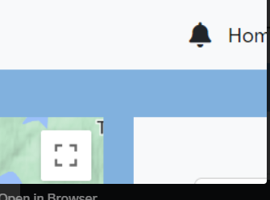
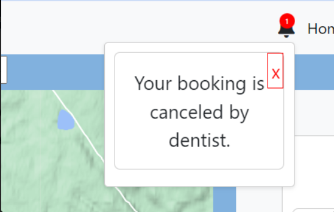

# Tooth Ferry Notification Service


## Getting started

To streamline the setup of the Tooth Ferry Notification Service using GitLab, follow the recommended steps below.

## Add your files

- [ ] [Create](https://docs.gitlab.com/ee/user/project/repository/web_editor.html#create-a-file) or [upload](https://docs.gitlab.com/ee/user/project/repository/web_editor.html#upload-a-file) files
- [ ] [Add files using the command line](https://docs.gitlab.com/ee/gitlab-basics/add-file.html#add-a-file-using-the-command-line) or push an existing Git repository with the following command:

```
cd existing_repo
git remote add origin git@git.chalmers.se:courses/dit355/2023/student-teams/dit356-2023-03/notification_service.git
git branch -M main
git push -uf origin main
```

## Integrate with your tools

- [ ] [Set up project integrations](https://git.chalmers.se/courses/dit355/2023/student-teams/dit356-2023-03/auth_service/-/settings/integrations)

## Collaborate with your team

- [ ] [Invite team members and collaborators](https://docs.gitlab.com/ee/user/project/members/)
- [ ] [Create a new merge request](https://docs.gitlab.com/ee/user/project/merge_requests/creating_merge_requests.html)
- [ ] [Automatically close issues from merge requests](https://docs.gitlab.com/ee/user/project/issues/managing_issues.html#closing-issues-automatically)
- [ ] [Enable merge request approvals](https://docs.gitlab.com/ee/user/project/merge_requests/approvals/)
- [ ] [Set auto-merge](https://docs.gitlab.com/ee/user/project/merge_requests/merge_when_pipeline_succeeds.html)

## Test and Deploy

Use the built-in continuous integration in GitLab.

- [ ] [Get started with GitLab CI/CD](https://docs.gitlab.com/ee/ci/quick_start/index.html)
- [ ] [Analyze your code for known vulnerabilities with Static Application Security Testing(SAST)](https://docs.gitlab.com/ee/user/application_security/sast/)
- [ ] [Deploy to Kubernetes, Amazon EC2, or Amazon ECS using Auto Deploy](https://docs.gitlab.com/ee/topics/autodevops/requirements.html)
- [ ] [Use pull-based deployments for improved Kubernetes management](https://docs.gitlab.com/ee/user/clusters/agent/)
- [ ] [Set up protected environments](https://docs.gitlab.com/ee/ci/environments/protected_environments.html)

***

## Tooth Ferry Notification Service

## Description
The Tooth Ferry Notification Service handles notifications for the Tooth Ferry project. It sends timely updates, such as booking confirmations and cancellations, to patients and dentists, ensuring efficient communication within the dental service platform.

## Visuals




## Installation
1. Clone the project to your IDE, such as Visual Studio, using the SSH code.
2. Once cloned, open a terminal on your IDE or through CMD.
3. Enter the command npm install. Run npm update if needed after installation.
4. Once all the relative files are installed, you can enter the command npm run dev to use the functionalities provided by notification services.

## Usage
1. A patient who has just made a dentist appointment might receive the notification: 
"Your booking has been made successfully."
2. A patient whose booking has been canceled by the dentist will receive this message: 
"Sorry, your booking has been canceled by the dentist."
3. A patient who has just canceled a dentist appointment might receive the notification: 
"Your booking has been canceled successfully."
4. A dentist whose booking has been canceled by the patient will receive this message: 
"The patient has canceled this booking (time)."
5. A dentist who has been booked for an appointment with the patient will receive this message: 
"The patient has booked an appointment (time)."           


## Support
Please contact our email support123@toothferry.com for any further support.

## Contributing
We welcome further contributions while adhering to our privacy policies.

## Authors and acknowledgment
We acknowledge and appreciate the contribution of all developers and maintainers of Tooth Ferry Notification Service as well as our Teaching Assistant, Examiners and Professors.

## Project status
The project has been completed but might require further maintenance and enhancements, such as for scaling further.
